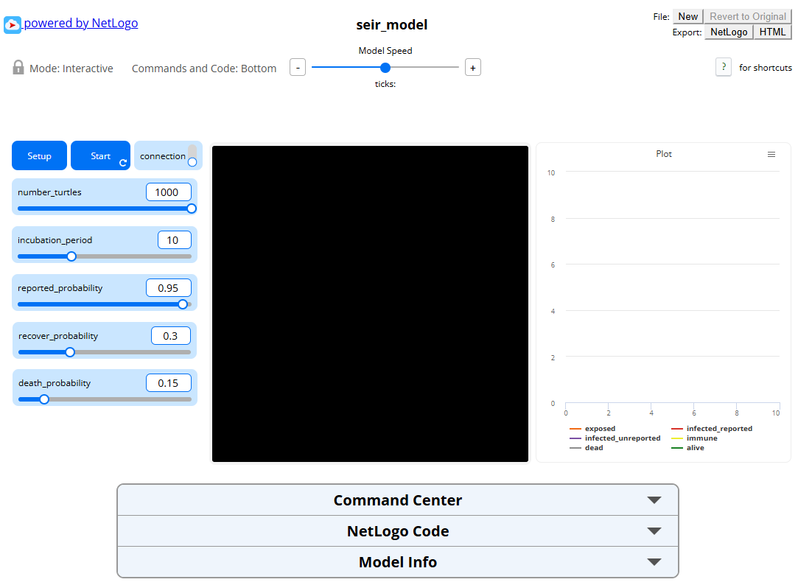

# SEIR Agent-Based Model for ABM Blog

## Description

This repository is for storing the NetLogo exported html file used in the ABM Blog which serves as our homework in the course CSC133 - Modelling and Simulation.

## Members:
- Bryle Jared Fantilanan
- Leonard John Corpuz
- Keane Pharelle Ledesma
- Zjann Henry Cuajotor

## ABM Blog:
[Link to our ABM Blog](https://sites.google.com/view/blkz-modsim/home?authuser=0)
